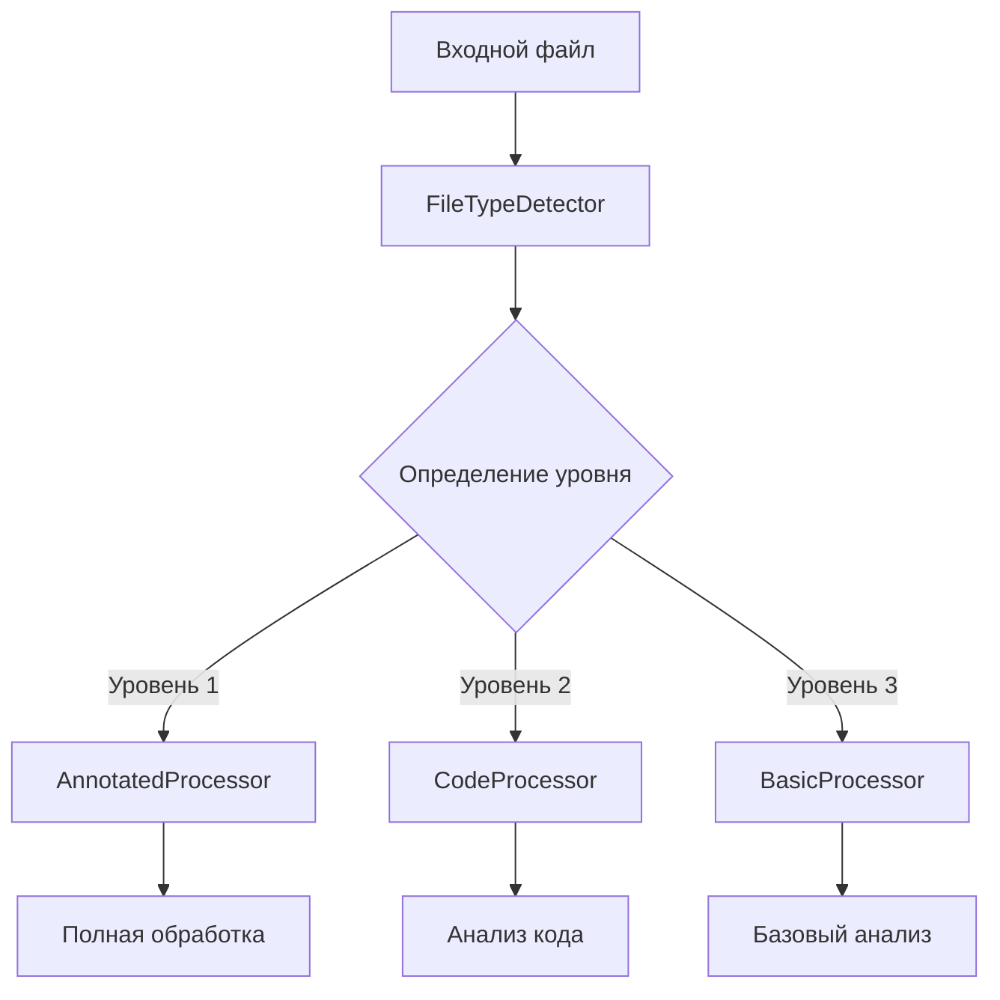

# Дизайн системы обработки контента

## Общая архитектура



## Компоненты системы

### 1. Определение типа и уровня файла
```python
class FileTypeDetector:
    def __init__(self):
        self.magic = python_magic.Magic(mime=True)
        self.annotated_files = self._load_annotated_files()
        
    def detect(self, file_path: str) -> FileInfo:
        """
        Определяет тип файла и уровень обработки
        
        Returns:
            FileInfo с полями:
            - level: int (1-3)
            - mime_type: str
            - category: str
            - annotations: Dict (для уровня 1)
        """
        # Проверка на аннотированный файл
        if file_path in self.annotated_files:
            return FileInfo(
                level=1,
                mime_type=self.magic.from_file(file_path),
                category=self.annotated_files[file_path].category,
                annotations=self.annotated_files[file_path]
            )
            
        # Определение типа файла
        mime_type = self.magic.from_file(file_path)
        
        # Проверка на исходный код
        if self._is_source_code(file_path, mime_type):
            return FileInfo(
                level=2,
                mime_type=mime_type,
                category='source_code'
            )
            
        # Остальные файлы
        return FileInfo(
            level=3,
            mime_type=mime_type,
            category='unknown'
        )
```

### 2. Базовый процессор
```python
class BaseContentProcessor:
    """Базовый класс для всех процессоров"""
    
    def process(self, file_path: str, file_info: FileInfo) -> ProcessingResult:
        """
        Базовая обработка файла
        
        Returns:
            ProcessingResult с полями:
            - content: str
            - metadata: Dict
            - errors: List[str]
        """
        raise NotImplementedError

class AnnotatedProcessor(BaseContentProcessor):
    """Процессор для файлов с аннотациями (Уровень 1)"""
    
    def process(self, file_path: str, file_info: FileInfo) -> ProcessingResult:
        # Получение существующих аннотаций
        annotations = file_info.annotations
        
        # Извлечение контента
        content = self._extract_content(file_path)
        
        # Дополнительный анализ
        metadata = {
            **annotations,
            **self._analyze_content(content),
            'processing_level': 1
        }
        
        return ProcessingResult(
            content=content,
            metadata=metadata,
            errors=[]
        )

class CodeProcessor(BaseContentProcessor):
    """Процессор для исходного кода (Уровень 2)"""
    
    def process(self, file_path: str, file_info: FileInfo) -> ProcessingResult:
        # Определение языка
        language = self._detect_language(file_path)
        
        # Получение парсера для языка
        parser = self._get_language_parser(language)
        
        # Анализ кода
        analysis = parser.analyze(file_path)
        
        return ProcessingResult(
            content=analysis.content,
            metadata={
                'language': language,
                'imports': analysis.imports,
                'functions': analysis.functions,
                'classes': analysis.classes,
                'processing_level': 2
            },
            errors=analysis.errors
        )

class BasicProcessor(BaseContentProcessor):
    """Процессор для остальных файлов (Уровень 3)"""
    
    def process(self, file_path: str, file_info: FileInfo) -> ProcessingResult:
        # Базовое извлечение текста
        content = self._extract_text(file_path)
        
        # Простой анализ
        metadata = {
            'keywords': self._extract_keywords(content),
            'patterns': self._find_patterns(content),
            'processing_level': 3
        }
        
        return ProcessingResult(
            content=content,
            metadata=metadata,
            errors=[]
        )
```

### 3. Система обработки
```python
class ContentProcessingSystem:
    def __init__(self):
        self.detector = FileTypeDetector()
        self.processors = {
            1: AnnotatedProcessor(),
            2: CodeProcessor(),
            3: BasicProcessor()
        }
        
    async def process_file(self, file_path: str) -> ProcessingResult:
        """
        Полная обработка одного файла
        """
        # Определение типа и уровня
        file_info = self.detector.detect(file_path)
        
        # Выбор процессора
        processor = self.processors[file_info.level]
        
        # Обработка
        return await processor.process(file_path, file_info)
        
    async def process_batch(self, files: List[str]) -> List[ProcessingResult]:
        """
        Пакетная обработка файлов
        """
        tasks = [self.process_file(f) for f in files]
        return await asyncio.gather(*tasks)
```

## Использование системы

```python
# Инициализация
system = ContentProcessingSystem()

# Обработка одного файла
result = await system.process_file("path/to/file")

# Пакетная обработка
results = await system.process_batch(["file1", "file2", "file3"])
```

## Преимущества подхода

1. Модульность
   - Каждый процессор независим
   - Легко добавлять новые типы обработки
   - Возможность замены компонентов

2. Масштабируемость
   - Асинхронная обработка
   - Пакетная обработка
   - Параллельное выполнение

3. Расширяемость
   - Поддержка новых языков программирования
   - Добавление новых анализаторов
   - Улучшение категоризации

## Следующие шаги

1. Реализация FileTypeDetector
2. Создание базовых процессоров
3. Тестирование на небольшой выборке
4. Оптимизация производительности
5. Добавление специфических анализаторов