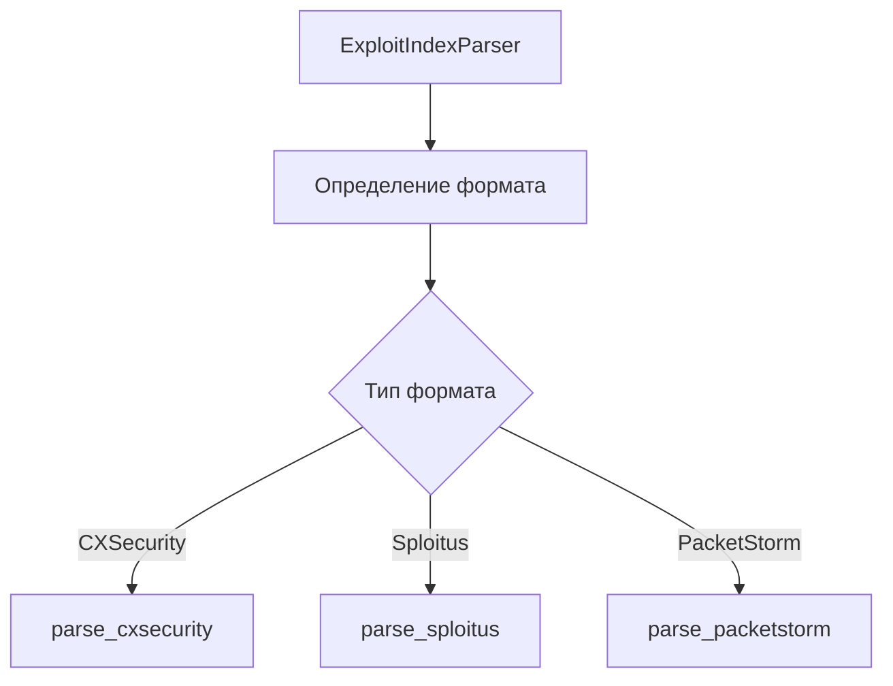

# Дизайн парсера для эксплойтов

## Форматы данных

### 1. CXSecurity формат
```
WLB-2025020021.txt:Adobe Reader CoolType Out-Of-Bounds Read
```
- ID: WLB-XXXXXXXXXX
- Расширение: .txt
- Разделитель: :
- Описание: однострочное

### 2. Sploitus формат
```
CVE-2025-24752-POC-main.zip:bartfroklage 2025-03-01 Exploit for CVE-2025-24752
```
- Имя файла содержит CVE
- Расширение: .zip
- Содержит: автор, дату, описание
- CVE ID в имени и описании

### 3. PacketStorm формат
```
crestengine10-xss.txt:2025-03-03;Crest Engine CMS version 1.0 suffers from a cross site scripting vulnerability.
```
- Имя файла: описательное
- Разделители: : и ;
- Содержит дату и описание

## Структура парсера



## Извлекаемые метаданные

```json
{
    "filename": "example.txt",
    "source": "cxsecurity|sploitus|packetstorm",
    "metadata": {
        "id": "WLB-XXXXXXXXXX|CVE-XXXX-XXXXX",
        "date": "YYYY-MM-DD",
        "author": "author name",
        "type": "exploit|poc|vulnerability",
        "cve": ["CVE-XXXX-XXXXX"],
        "tags": ["xss", "rce", "sql", ...]
    },
    "description": "Full description",
    "source_index": "path/to/index.txt"
}
```

## Категоризация

### Типы уязвимостей
- XSS (Cross-Site Scripting)
- RCE (Remote Code Execution)
- SQLi (SQL Injection)
- File Upload
- Path Traversal
- Authentication Bypass

### Теги для автоматического определения
```python
VULNERABILITY_PATTERNS = {
    'xss': r'(?i)(cross.*site.*script|xss)',
    'rce': r'(?i)(remote.*code.*exec|rce)',
    'sqli': r'(?i)(sql.*inject|sqli)',
    'upload': r'(?i)(unrestricted.*file.*upload)',
    'traversal': r'(?i)(path.*traversal|directory.*traversal)',
    'bypass': r'(?i)(auth.*bypass|authentication.*bypass)',
    'overflow': r'(?i)(buffer.*overflow|stack.*overflow)',
    'injection': r'(?i)(command.*inject|code.*inject)',
}
```

## Алгоритм обработки

1. Определение формата:
   ```python
   def detect_format(self, content: str) -> str:
       if re.match(r'WLB-\d+\.txt:', content):
           return 'cxsecurity'
       elif 'CVE-' in content:
           return 'sploitus'
       else:
           return 'packetstorm'
   ```

2. Извлечение метаданных:
   - Поиск CVE ID
   - Определение типа уязвимости
   - Извлечение даты
   - Определение автора

3. Категоризация:
   - По типу уязвимости
   - По затронутому ПО
   - По степени опасности

## Обработка ошибок

1. Неизвестный формат:
   ```python
   class UnknownFormatError(Exception):
       pass
   ```

2. Отсутствие обязательных полей:
   ```python
   class MissingFieldError(Exception):
       pass
   ```

3. Некорректный формат даты:
   ```python
   class InvalidDateError(Exception):
       pass
   ```

## Валидация данных

1. Проверка CVE ID:
   ```python
   def validate_cve(self, cve: str) -> bool:
       return bool(re.match(r'CVE-\d{4}-\d{4,7}', cve))
   ```

2. Проверка даты:
   ```python
   def validate_date(self, date: str) -> bool:
       try:
           datetime.strptime(date, '%Y-%m-%d')
           return True
       except ValueError:
           return False
   ```

## Интеграция

1. Наследование от BaseParser:
   ```python
   class ExploitIndexParser(BaseParser):
       def parse_file(self, file_path: str) -> List[Dict]:
           # Реализация парсера
   ```

2. Использование существующей инфраструктуры:
   - Логирование
   - Обработка ошибок
   - Статистика

## Следующие шаги

1. Реализация базового парсера для CXSecurity
2. Добавление поддержки Sploitus
3. Интеграция PacketStorm формата
4. Тестирование на реальных данных
5. Оптимизация производительности