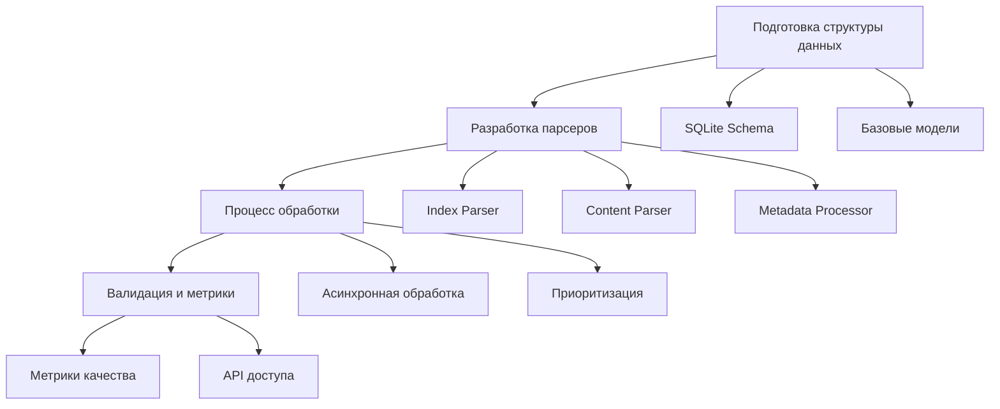

# План реализации парсера для датасета по компьютерной безопасности

## Диаграмма процесса

## Этапы реализации

### 1. Этап подготовки (2-3 дня)
- Создание SQLite схемы с индексами для оптимизации запросов
  - Индексы для часто используемых полей (filename, category)
  - Оптимизация для полнотекстового поиска
- Реализация базовых моделей с валидацией данных
  - Pydantic модели для валидации входных данных
  - ORM модели для работы с БД
- Разработка механизма миграций для будущих изменений схемы
  - Система версионирования схемы
  - Автоматические миграции при изменениях

### 2. Разработка парсеров (4-5 дней)
- IndexParser с поддержкой различных форматов аннотаций
  - Гибкий парсинг форматов дат
  - Извлечение структурированной информации из описаний
  - Обработка множественных аннотаций
- ContentParser с определением типов файлов и кодировок
  - Автоопределение кодировок
  - Поддержка различных форматов файлов
  - Извлечение текста из бинарных форматов
- MetadataProcessor для извлечения структурированной информации
  - Извлечение CVE идентификаторов
  - Определение категорий и подкатегорий
  - Анализ временных меток
- Фабрика парсеров для масштабируемости
  - Динамическая загрузка парсеров
  - Конфигурируемые параметры обработки

### 3. Процесс обработки (5-7 дней)
- Асинхронный pipeline обработки с управлением памятью
  - Пул воркеров для параллельной обработки
  - Контроль потребления ресурсов
  - Механизм очередей
- Система приоритизации файлов
  - Обработка сначала файлов с аннотациями
  - Приоритеты по типам файлов
  - Динамическое управление приоритетами
- Механизм восстановления после сбоев
  - Сохранение состояния обработки
  - Автоматический рестарт при ошибках
  - Пропуск проблемных файлов
- Логирование и мониторинг процесса
  - Детальное логирование операций
  - Метрики производительности
  - Алерты при проблемах

### 4. Валидация и метрики (3-4 дня)
- Разработка системы метрик качества данных
  - Покрытие аннотациями
  - Качество извлечения текста
  - Полнота метаданных
- Реализация API для доступа к данным
  - REST API для поиска
  - Фильтрация по метаданным
  - Пагинация результатов
- Создание инструментов анализа и визуализации
  - Статистика по категориям
  - Временные распределения
  - Отчеты о качестве данных

## Потенциальные риски и решения

### 1. Производительность
- **Риск**: Медленная обработка большого количества файлов
- **Решения**:
  - Асинхронная обработка с пулом воркеров
  - Батчевая загрузка в БД
  - Индексы для часто используемых запросов
  - Оптимизация алгоритмов парсинга

### 2. Качество данных
- **Риск**: Неструктурированные или некорректные аннотации
- **Решения**:
  - Robust парсинг с обработкой ошибок
  - Система валидации данных
  - Логирование проблемных случаев
  - Механизм ручной проверки сложных случаев

### 3. Масштабируемость
- **Риск**: Ограничения SQLite при параллельной записи
- **Решения**:
  - Очередь записи в БД
  - Возможность шардирования данных
  - Опциональный переход на PostgreSQL
  - Оптимизация конкурентного доступа

### 4. Память
- **Риск**: Высокое потребление памяти при обработке
- **Решения**:
  - Потоковая обработка файлов
  - Управление размером батчей
  - Очистка памяти после обработки
  - Мониторинг потребления ресурсов

## Следующие шаги

1. Настройка окружения разработки
2. Создание базовой структуры проекта
3. Реализация первого этапа - подготовка структуры данных
4. Ежедневные проверки прогресса и корректировка плана при необходимости