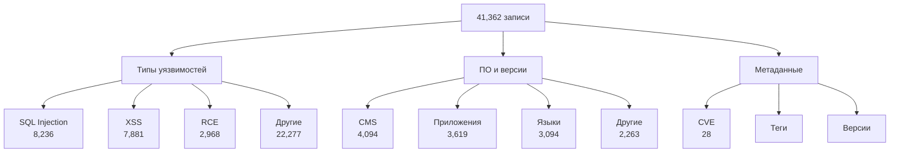
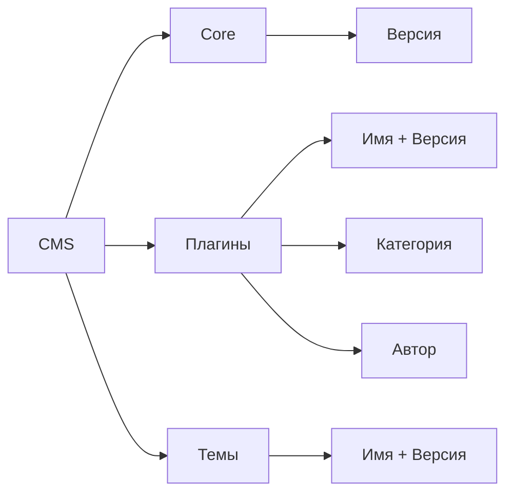
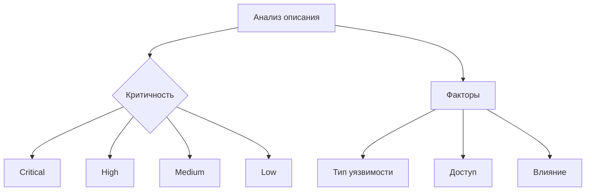
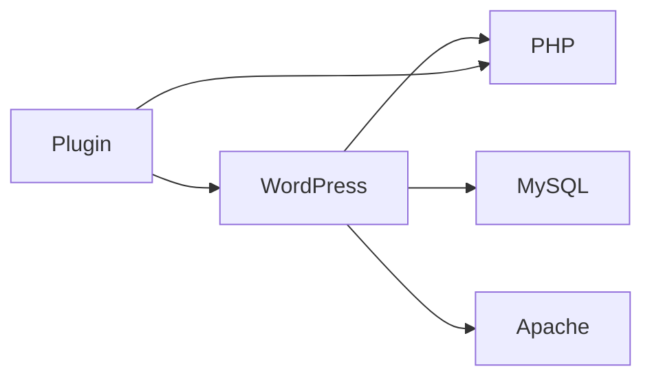

# План улучшений парсера эксплойтов

## Текущее состояние


## Направления улучшений

### 1. Компоненты и плагины


#### 1.1 Извлечение информации о плагинах
- Паттерны для определения плагинов:
```python
PLUGIN_PATTERNS = {
    'wordpress': {
        'plugin': r'(?i)wp-content/plugins/([^/]+)',
        'theme': r'(?i)wp-content/themes/([^/]+)',
        'author': r'(?i)by\s+([^|]+?)\s*(?:\||$)',
        'category': r'(?i)(form|seo|security|backup|ecommerce)'
    },
    'joomla': {
        'component': r'(?i)com_([a-z0-9_]+)',
        'module': r'(?i)mod_([a-z0-9_]+)',
        'plugin': r'(?i)plg_([a-z0-9_]+)'
    }
}
```

#### 1.2 Связи между компонентами
```json
{
    "software": {
        "cms": {
            "wordpress": "6.0",
            "plugins": {
                "contact-form-7": {
                    "version": "5.1.2",
                    "author": "Takayuki Miyoshi",
                    "category": "form"
                }
            }
        }
    }
}
```

### 2. Определение критичности


#### 2.1 Факторы критичности
```python
SEVERITY_FACTORS = {
    'critical': {
        'types': ['rce', 'sqli', 'auth_bypass'],
        'impact': ['remote', 'root', 'admin'],
        'access': ['unauthenticated', 'remote']
    },
    'high': {
        'types': ['xss', 'upload', 'traversal'],
        'impact': ['data_leak', 'privilege'],
        'access': ['authenticated']
    },
    'medium': {
        'types': ['csrf', 'ssrf', 'xxe'],
        'impact': ['disclosure', 'dos'],
        'access': ['local']
    },
    'low': {
        'types': ['info_disclosure'],
        'impact': ['minor'],
        'access': ['restricted']
    }
}
```

#### 2.2 Формат метаданных
```json
{
    "metadata": {
        "severity": {
            "level": "critical",
            "score": 9.8,
            "factors": {
                "type": "rce",
                "impact": "remote",
                "access": "unauthenticated"
            }
        }
    }
}
```

### 3. Связи между ПО

#### 3.1 Типы связей


#### 3.2 Структура данных
```python
SOFTWARE_RELATIONS = {
    'wordpress': {
        'requires': ['php', 'mysql'],
        'optional': ['apache', 'nginx'],
        'incompatible': ['php < 5.6']
    },
    'joomla': {
        'requires': ['php', 'mysql'],
        'optional': ['apache', 'nginx'],
        'incompatible': ['php < 7.0']
    }
}
```

#### 3.3 Вывод связей
```json
{
    "software": {
        "cms": {
            "wordpress": "6.0"
        },
        "relations": {
            "requires": {
                "language": {
                    "php": ">=7.4"
                },
                "database": {
                    "mysql": ">=5.7"
                }
            },
            "optional": {
                "server": {
                    "apache": null,
                    "nginx": null
                }
            }
        }
    }
}
```

## Реализация

### Этап 1: Компоненты (2-3 дня)
1. Добавление паттернов для плагинов
2. Извлечение метаданных компонентов
3. Структурирование связей

### Этап 2: Критичность (2-3 дня)
1. Реализация анализа факторов
2. Расчет уровня критичности
3. Добавление scoring системы

### Этап 3: Связи (2-3 дня)
1. Определение зависимостей
2. Построение графа связей
3. Валидация совместимости

## Ожидаемые результаты

1. Улучшение качества данных:
   - Точное определение компонентов
   - Оценка критичности уязвимостей
   - Понимание зависимостей

2. Новые возможности анализа:
   - Поиск уязвимых компонентов
   - Оценка рисков
   - Анализ совместимости

3. Метрики успеха:
   - Определение > 90% плагинов
   - Точность критичности > 85%
   - Полнота связей > 80%