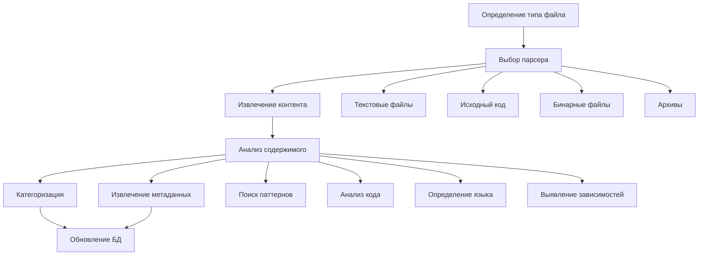

# План реализации: Этап 2 - Обработка контента файлов

## Цели этапа
1. Реализация системы обработки контента различных типов файлов
2. Улучшение категоризации на основе анализа содержимого
3. Извлечение дополнительных метаданных
4. Оптимизация производительности и использования ресурсов

## Диаграмма процесса



## Компоненты системы

### 1. Определение типа файла (2-3 дня)
- Использование python-magic для определения MIME-типов
- Анализ расширений и сигнатур файлов
- Создание карты соответствия типов и парсеров

### 2. Парсеры контента (5-7 дней)
#### 2.1 Текстовые файлы
- Определение кодировок (chardet)
- Извлечение текста
- Базовая очистка и нормализация

#### 2.2 Исходный код
- Определение языка программирования
- Парсинг структуры кода
- Извлечение:
  * Импортов и зависимостей
  * Функций и классов
  * Комментариев и документации

#### 2.3 Бинарные файлы
- Анализ заголовков
- Извлечение строк
- Поиск сигнатур и паттернов

#### 2.4 Архивы
- Рекурсивная обработка содержимого
- Анализ структуры архива
- Извлечение метаданных архива

### 3. Анализ содержимого (4-5 дней)
#### 3.1 Поиск паттернов
- Регулярные выражения для:
  * URL и доменов
  * IP адресов
  * Путей файлов
  * API ключей и токенов

#### 3.2 Анализ кода
- Поиск уязвимых паттернов
- Определение функциональности
- Анализ импортов и зависимостей

#### 3.3 Классификация
- Определение основной функциональности
- Категоризация по назначению
- Выявление связей между файлами

### 4. Метаданные и категоризация (3-4 дня)
#### 4.1 Расширенные метаданные
- Языки программирования
- Зависимости и библиотеки
- API и протоколы
- Целевые системы и платформы

#### 4.2 Улучшенная категоризация
- Многоуровневая классификация
- Теги на основе содержимого
- Связи между компонентами

#### 4.3 Валидация данных
- Проверка корректности категорий
- Валидация метаданных
- Контроль качества данных

### 5. Оптимизация (3-4 дня)
#### 5.1 Производительность
- Кэширование результатов
- Оптимизация памяти
- Улучшение параллельной обработки

#### 5.2 Хранение данных
- Оптимизация схемы БД
- Индексы для поиска
- Сжатие данных

## Структура кода

```
security_dataset/
├── src/
│   ├── content/
│   │   ├── detector.py     # Определение типа файла
│   │   ├── base.py        # Базовый класс парсера контента
│   │   ├── text.py        # Парсер текстовых файлов
│   │   ├── code.py        # Парсер исходного кода
│   │   ├── binary.py      # Парсер бинарных файлов
│   │   └── archive.py     # Парсер архивов
│   ├── analysis/
│   │   ├── patterns.py    # Поиск паттернов
│   │   ├── classifier.py  # Классификация контента
│   │   └── metadata.py    # Извлечение метаданных
│   └── utils/
│       ├── cache.py       # Кэширование
│       └── compression.py # Сжатие данных
```

## Риски и решения

### 1. Производительность
- Риск: Медленная обработка больших файлов
- Решение: 
  * Потоковая обработка
  * Частичное извлечение
  * Кэширование результатов

### 2. Память
- Риск: Высокое потребление при обработке архивов
- Решение:
  * Ограничение глубины рекурсии
  * Поэтапная распаковка
  * Очистка временных файлов

### 3. Точность
- Риск: Неточная категоризация
- Решение:
  * Многоуровневый анализ
  * Комбинация методов
  * Валидация результатов

## Метрики успеха
1. Покрытие типов файлов > 90%
2. Точность категоризации > 85%
3. Полнота метаданных > 80%
4. Производительность > 100 файлов/мин
5. Использование памяти < 1GB на процесс

## Следующие шаги
1. Реализация базового определения типов файлов
2. Создание парсеров для основных типов
3. Разработка системы анализа содержимого
4. Интеграция с существующей БД
5. Оптимизация и тестирование