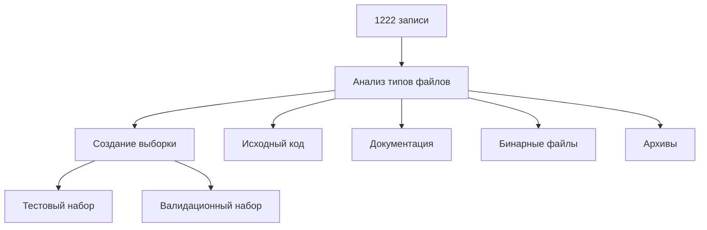

# Инициализация второго этапа

## Анализ текущего датасета
- Обработано индексных файлов: 11
- Извлечено записей: 1222
- Покрытие разных разделов:
  * shellcodes
  * exploits
  * util
  * Doc
  * systemerror

## План инициализации

### 1. Подготовка тестовой выборки


#### 1.1 Критерии выборки
- Представительность всех типов файлов
- Разные размеры файлов
- Различные форматы и кодировки
- Файлы из разных разделов

#### 1.2 Размер выборок
- Тестовый набор: 100 файлов
- Валидационный набор: 50 файлов

### 2. Начальная реализация

#### 2.1 Система определения типов (detector.py)
```python
class FileTypeDetector:
    def __init__(self):
        self.mime_detector = magic.Magic(mime=True)
        self.type_matchers = {
            'text/': self._handle_text,
            'application/': self._handle_application,
            'image/': self._handle_image
        }
    
    def detect(self, file_path: str) -> Dict:
        """
        Определение типа файла и базовых характеристик
        """
        pass
```

#### 2.2 Схема метаданных контента
```json
{
    "file_info": {
        "mime_type": "text/x-python",
        "encoding": "utf-8",
        "size": 1234,
        "magic_sig": "Python script"
    },
    "content_type": {
        "category": "source_code",
        "language": "python",
        "binary": false
    },
    "analysis": {
        "imports": [],
        "functions": [],
        "strings": [],
        "patterns": []
    }
}
```

### 3. Тестовая инфраструктура

#### 3.1 Метрики тестирования
- Точность определения типа
- Корректность извлечения контента
- Производительность обработки
- Потребление ресурсов

#### 3.2 Тестовые сценарии
1. Определение типа файла
2. Извлечение текстового содержимого
3. Обработка различных кодировок
4. Работа с архивами
5. Извлечение метаданных

## Следующие шаги

1. Создать тестовую выборку из текущего датасета
2. Реализовать базовую версию FileTypeDetector
3. Разработать тесты на тестовой выборке
4. Приступить к реализации парсеров для основных типов файлов

## Необходимые зависимости
```
python-magic>=0.4.27
chardet>=5.0.0
libmagic-dev
unrar
p7zip-full
```

## Ожидаемые результаты
1. Работающий детектор типов файлов
2. Подготовленная тестовая инфраструктура
3. Тестовая и валидационная выборки
4. Базовая схема метаданных контента