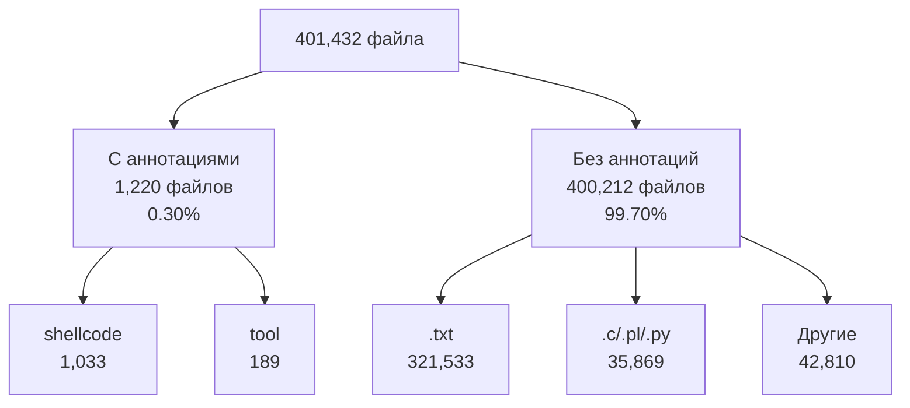
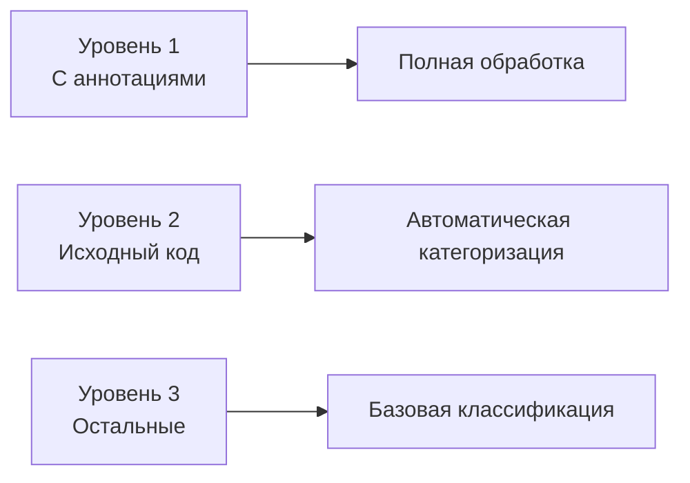

# Обновленный план второго этапа

## Текущая ситуация


## Корректировка подхода

### 1. Многоуровневая обработка


### 2. Приоритеты обработки

#### Уровень 1: Файлы с аннотациями (1,220)
- Детальная обработка контента
- Извлечение всех метаданных
- Создание эталонной выборки

#### Уровень 2: Исходный код (~36k)
- Анализ кода (.c, .pl, .py, .rb, .php)
- Определение функциональности
- Автоматическое извлечение метаданных:
  * Импорты и зависимости
  * Паттерны и сигнатуры
  * Комментарии и документация

#### Уровень 3: Текстовые файлы (321k+)
- Базовая классификация
- Извлечение ключевых слов
- Определение типа контента

### 3. Модификация архитектуры

#### 3.1 Система классификации
```python
class ContentClassifier:
    def __init__(self):
        self.levels = {
            1: AnnotatedContentProcessor(),
            2: CodeContentProcessor(),
            3: BasicContentProcessor()
        }
        self.patterns = {
            "exploits": r"CVE-\d{4}-\d{4,7}|exploit|vulnerability",
            "shellcode": r"shellcode|payload|assembly",
            "tools": r"tool|utility|script",
            "documentation": r"manual|guide|tutorial|doc"
        }
```

#### 3.2 Параллельная обработка
```python
class BatchProcessor:
    def __init__(self, batch_size=1000, workers=96):
        self.batch_size = batch_size
        self.workers = workers
        self.queue = asyncio.Queue()
        
    async def process_level(self, level: int, files: List[str]):
        processor = self.get_processor(level)
        batches = self.create_batches(files)
        async with ProcessPoolExecutor(max_workers=self.workers) as pool:
            await asyncio.gather(*[
                self.process_batch(batch, processor, pool)
                for batch in batches
            ])
```

### 4. Оптимизация хранения

#### 4.1 Партиционирование данных
- Разделение по уровням обработки
- Отдельные таблицы для разных типов контента
- Индексы для быстрого поиска

#### 4.2 Сжатие данных
- Сжатие текстового контента
- Дедупликация кода
- Оптимизация метаданных

## План реализации

### Этап 2.1: Базовая инфраструктура (1 неделя)
1. Система определения уровня файла
2. Базовые процессоры для каждого уровня
3. Механизм параллельной обработки

### Этап 2.2: Обработка аннотированных файлов (1 неделя)
1. Полный парсер контента
2. Извлечение всех метаданных
3. Создание эталонных данных

### Этап 2.3: Обработка исходного кода (2 недели)
1. Парсеры для основных языков
2. Система анализа кода
3. Автоматическая категоризация

### Этап 2.4: Массовая обработка (2 недели)
1. Обработка текстовых файлов
2. Базовая классификация
3. Оптимизация производительности

## Метрики успеха
1. Обработка 100% аннотированных файлов
2. Автоматическая категоризация > 50% исходного кода
3. Базовая классификация > 80% всех файлов
4. Производительность > 1000 файлов/минуту
5. Использование памяти < 2GB на процесс

## Риски и решения
1. Большой объем данных
   - Поэтапная обработка
   - Оптимизация хранения
   - Параллельная обработка

2. Качество классификации
   - Эталонная выборка
   - Множественные методы
   - Валидация результатов

3. Производительность
   - Оптимизация алгоритмов
   - Кэширование
   - Распределенная обработка